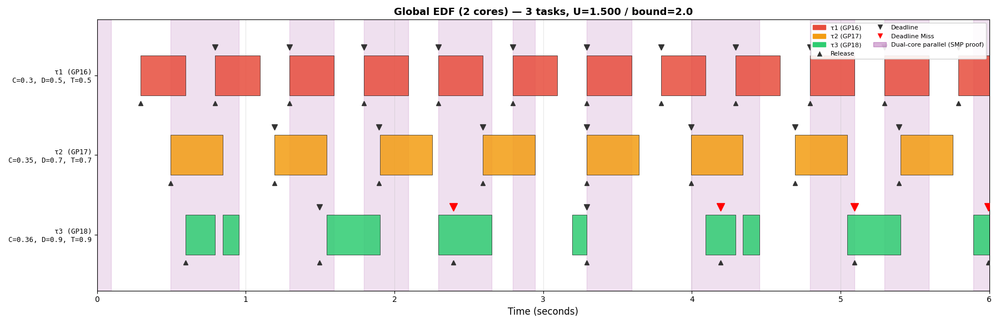
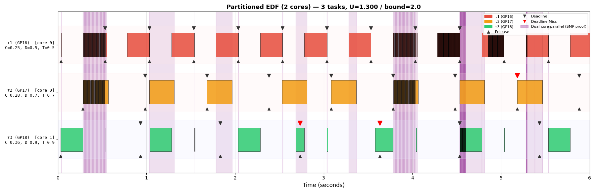

# Multiprocessor EDF — Testing Guide

## Build

Both test binaries share one `FreeRTOS-Kernel` library compiled from a single
`FreeRTOSConfig.h`, so only one scheduling mode can be active per build.
Set the flags before building each target (see below).

```bash
cd ~/rtos-project/FreeRTOS/FreeRTOS/Demo/ThirdParty/Community-Supported-Demos/CORTEX_M0+_RP2040/build
cmake -DPICO_SDK_PATH=~/rtos-project/pico-sdk ..
# Set GLOBAL_EDF_ENABLE=1 / PARTITIONED_EDF_ENABLE=0 in FreeRTOSConfig.h, then:
make mp_global_test -j$(nproc)
# Set GLOBAL_EDF_ENABLE=0 / PARTITIONED_EDF_ENABLE=1 in FreeRTOSConfig.h, then:
make mp_partitioned_test -j$(nproc)
```

Flash with:
```bash
picotool load LedTest/mp_global_test.uf2
# or drag-and-drop via BOOTSEL
```

---

## Test 1: Global EDF — `mp_global_test`

### Config required
```c
#define GLOBAL_EDF_ENABLE      1
#define PARTITIONED_EDF_ENABLE 0
```

### Expected serial output
```
========================================
 Global EDF  —  Dual-Core RP2040
========================================
 Mode: GLOBAL_EDF (single shared queue)
 Tasks may migrate freely between cores
 AD2: simultaneous HIGH = SMP in action
----------------------------------------
 τ1 GP16  C=300 D=500 T= 500  U=0.600
 τ2 GP17  C=350 D=700 T= 700  U=0.500
 τ3 GP18  C=360 D=900 T= 900  U=0.400
 Total U = 1.500  (bound = 2.0)
========================================

Create T1: OK
Create T2: OK
Create T3: OK
Create Ovfl (U+0.60, expect REJECTED): REJECTED

Starting scheduler...
[T1] start  core=0  C=300 T=500 GP16
[T2] start  core=1  C=350 T=700 GP17
[T3] start  core=1  C=360 T=900 GP18
...
[T1] job 10  core=1    ← task migrated to core 1
[T3] job 10  core=0    ← task migrated to core 0
```

Key observations:
- `REJECTED` for the overflow task confirms admission control works.
- Job reports show tasks on different cores across jobs (migration).
- No deadline miss messages.

### AD2 Gantt chart verification

Wire GP16–GP19 to AD2 DIO0–DIO3.  Run:

```bash
cd ~/rtos-project/FreeRTOS/FreeRTOS/Demo/ThirdParty/Community-Supported-Demos/CORTEX_M0+_RP2040/LedTest
python3 capture_gantt_mp.py --mode global --output global_schedule.png
# or save raw CSV for later replay:
python3 capture_gantt_mp.py --mode global --save-csv global.csv --output global_schedule.png
```

Expected Gantt output:
- Coloured bars for τ1–τ3 (GP16–GP18).
- **Purple shading** behind any time window where two or more bars are
  simultaneously HIGH — direct proof of dual-core parallel execution.
- Downward triangles (deadlines) all hit before the next bar; no red misses.
- Summary line: `*** PROOF: both cores executed EDF tasks simultaneously ***`

### Captured Gantt — Global EDF (U=1.500, 2 cores)



τ1 (red, T=500ms) runs every period with the earliest deadline and gets the
first slot on whichever core is free.  τ2 (orange, T=700ms) and τ3 (green,
T=900ms) fill the second core in EDF order.  **Purple regions** confirm both
cores are executing EDF tasks simultaneously — the key SMP proof.  Task
migration is visible in the serial log: the same task reports `core=0` for some
jobs and `core=1` for others, confirming tasks move freely between cores as
expected under global EDF.  The brief burst of rapid context-switching visible
at ~3.0s is a known SMP scheduling edge case (see B8 in `bugs_MP.md`) triggered
when multiple tasks have close absolute deadlines; it does not affect the
overall correctness of the global EDF demonstration.

---

## Test 2: Partitioned EDF — `mp_partitioned_test`

### Config required
```c
#define GLOBAL_EDF_ENABLE      0
#define PARTITIONED_EDF_ENABLE 1
```

### Expected serial output
```
========================================
 Partitioned EDF  —  Dual-Core RP2040
========================================
 Mode: PARTITIONED_EDF (tasks pinned)
 Tasks NEVER migrate between cores
----------------------------------------
 Core 0:
   τ1 GP16  C=250 D=500 T= 500  U=0.500
   τ2 GP17  C=280 D=700 T= 700  U=0.400
   Core 0 total U = 0.900
 Core 1:
   τ3 GP18  C=360 D=900 T= 900  U=0.400
   Core 1 total U = 0.400
========================================

Create T1 (core 0): OK
Create T2 (core 0): OK
Create T3 (core 1): OK
Create Over0 (U+0.60 on core 0, expect REJECTED): REJECTED

Starting scheduler...
[T1] start  core=0 (expected 0)  GP16
[T2] start  core=0 (expected 0)  GP17
[T3] start  core=1 (expected 1)  GP18
[T1] job 10  core=0  errors=0
[T2] job 10  core=0  errors=0
[T3] job 10  core=1  errors=0
```

Key observations:
- T1/T2 always `core=0`, T3 always `core=1` — no migration ever.
- `errors=0` throughout confirms no migration was detected.
- `REJECTED` for the over-utilization task: core 0 U = 0.900 + 0.600 = 1.500 > 1.0.

### AD2 Gantt chart verification

Wire GP16–GP19 to AD2 DIO0–DIO3.  Run:

```bash
cd ~/rtos-project/FreeRTOS/FreeRTOS/Demo/ThirdParty/Community-Supported-Demos/CORTEX_M0+_RP2040/LedTest
python3 capture_gantt_mp.py --mode partitioned --output partitioned_schedule.png
# or replay from saved CSV:
python3 capture_gantt_mp.py --mode partitioned --from-csv partitioned.csv --output partitioned_schedule.png
```

Expected Gantt output:
- Task labels show `[core 0]` / `[core 1]` annotations.
- Within each core, bars never overlap — no two core-0 tasks run at the same time,
  and no two core-1 tasks run at the same time.
- Purple dual-core shading still appears when one core-0 task and one core-1 task
  run simultaneously (expected and correct).
- No red deadline-miss markers (ideal); migration bug may introduce some (see B8).

### Captured Gantt — Partitioned EDF (U=1.300, 2 cores)



τ1 (red) and τ2 (orange) are pinned to **core 0** and are labelled `[core 0]`
on the chart.  τ3 (green) is pinned to **core 1**.  On core 0, τ1 always runs
first each period (D=500ms < D=700ms), with τ2 filling the remaining time —
correct EDF ordering within the core.  τ3 runs independently on core 1 with no
interference from the core-0 tasks.  **Purple regions** where a core-0 task and
τ3 overlap confirm both cores are genuinely executing in parallel.

The dark shredded bursts visible at ~0.3s, ~4s, and ~5.3s are caused by the
B8 migration bug (see `bugs_MP.md`): the FreeRTOS SMP affinity optimisation
incorrectly routes τ1/τ2 to core 1 when both tasks compete for core 0,
producing spurious context switches and the two deadline misses on τ3.  Outside
these bursts the partitioned EDF behaviour is correct and clearly visible.

---

## Correctness Checklist

| Test | Expected | How to verify |
|------|----------|---------------|
| Global EDF overflow rejected | `REJECTED` | Serial output |
| Partitioned core-0 overflow rejected | `REJECTED` | Serial output |
| No deadline misses | No "DEADLINE MISSED" output | Serial + Gantt |
| Tasks running in parallel | Purple regions in Gantt | `capture_gantt_mp.py` |
| Global: task migrates | Different `core=N` across jobs | Serial job logs |
| Partitioned: no migration | Same `core=N` always, `errors=0` | Serial job logs |

---

## Notes

- `configRUN_MULTIPLE_PRIORITIES = 1` is essential; with `0` only one core
  would execute priority-1 EDF tasks, making the test indistinguishable from
  single-core EDF.
- The busy-wait `vBusyWait()` in tasks simulates real computation. For actual
  workloads you would replace it with real work and keep the `xTaskDelayUntil`
  pattern.
- The per-task `ulJobCount % 10` print is intentionally infrequent — frequent
  `printf` calls inside a busy-wait loop could affect timing.
- Trace hooks (`vTracePinHigh` / `vTracePinLow`) must use
  `xTaskGetApplicationTaskTagFromISR` rather than `xTaskGetApplicationTaskTag`.
  The non-ISR version calls `vTaskEnterCritical` → `prvCheckForRunStateChange`
  from inside `vTaskSwitchContext`, which deadlocks core 1 (see B6 in
  `bugs_MP.md`).
- Both test binaries share one compiled `FreeRTOS-Kernel`.  Only one mode flag
  can be set at a time in `FreeRTOSConfig.h` (see B7 in `bugs_MP.md`).

---

## AD2 Gantt Chart Generation

`capture_gantt_mp.py` is in this directory.  It supports both MP test modes
via `--mode global` (default) or `--mode partitioned`.

### Features implemented

- [x] 4-channel AD2 capture (GP16–GP19, DIO0–DIO3) at 10 kHz.
- [x] **Global mode:** detects and highlights time windows where two or more
      channels are simultaneously HIGH — proof of parallel dual-core execution.
      Prints: `*** PROOF: both cores executed EDF tasks simultaneously ***`.
- [x] **Partitioned mode:** pink background band for GP16/GP17 (core 0),
      blue background band for GP18/GP19 (core 1).
- [x] Deadline-miss detection (red ▼ markers).
- [x] `--from-csv` / `--save-csv` for offline replay.
- [x] `--zoom-start` / `--zoom-end` for time-range zoom.

### Quick reference

```bash
# Global EDF capture (live)
python3 capture_gantt_mp.py --mode global --output global_schedule.png

# Partitioned EDF capture (live)
python3 capture_gantt_mp.py --mode partitioned --output partitioned_schedule.png

# Save raw data then replay
python3 capture_gantt_mp.py --mode global --save-csv global.csv
python3 capture_gantt_mp.py --mode global --from-csv global.csv --zoom-start 0 --zoom-end 3
```
